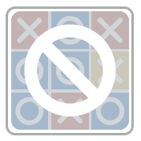

### Some Terminologies

**Active Grid**

 

**Inactive Grid**

 

Normal Square

Last Active Square

 

**Square** inside the Grid

Last Played Squares have different hue and brightness level

  

* * *

  

### How to Play ?

1.  First Player (Playing **X**) is allowed to Play in any Grid (All Grids are Active)
    
2.  The Player Chooses the Position (Square) to Play on that Grid
    
    *   and the same Position of the Square Choosen (ex: topLeft Square) by First Player is the active Grid (topLeft Grid) on which the second Player Plays
        
    *   Second Player has to play on that Active Grid
        
    *   _example_:
        
        1.  **Player X** Chooses Top Left of a Square in the Center Grid
            
            
        2.  Since the Choosen Square is Top Left, the next Active Grid is Top Left
            
            
        3.  **Player O** plays the Top Left Grid and Chooses a Square Center
            
        4.  Choosen Square is Center so, Center Grid Becomes Active for **Player X**
            
            
        5.  **Player X** chooses a Square in Center Grid
            
            

3.  A Grid is captured by the Player if he wins in that Grid. The same Grid will never become Active Grid.
    
    *   If the same Position of a Square is Played in any Other Grid, the Other Grids Become Active
    *   _example_:
        
        1.  **Player O** wins Top Left Grid
            
        2.  If **Player X** chooses the Top Left Square in an Active Grid, **Player O** will be allowed to play any other Grid
            
            
        3.  **Player O** will be able to play any Grid except the Top Left Grid (or any Grid won or that is draw)
            

4.  A Grid Becomes Draw if there are no Squares to Play
    
    

5.  The final Game is won if a Player Wins 3 Grids in the Order of a Normal Tic-Tac-Toe
    
    

* * *

### Rules

1.  Players can only Play in an Active Grid (Dark Border)
    
2.  Players can't play in Grid won before, or that becomes draw
    
    